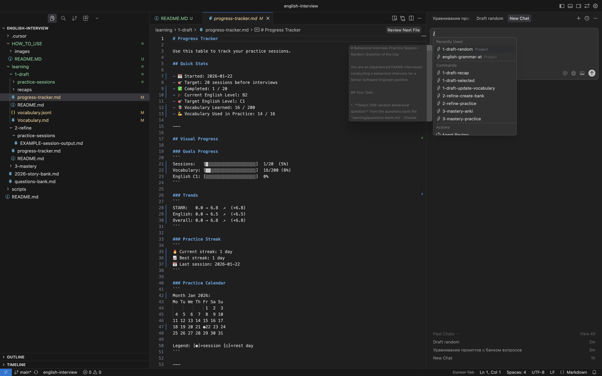
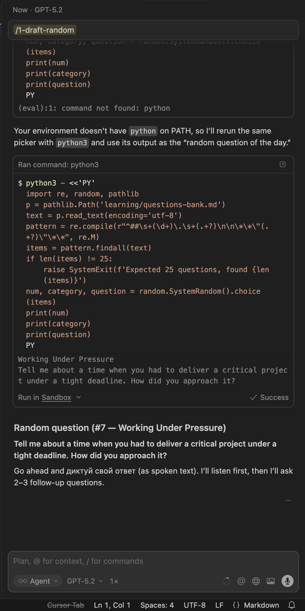

# 📖 How to Use This Framework

Complete guide to preparing for behavioral interviews in English.

---

## 🎯 Overview

Three phases, each with specific commands:

| Phase | Goal | Duration | Commands |
|-------|------|----------|----------|
| **1-Draft** | Collect 5-7 stories | 2-4 weeks | `1-draft-random`, `1-draft-selected`, `1-draft-recap` |
| **2-Refine** | Own your stories | 1-2 weeks | `2-refine-create-bank`, `2-refine-practice` |
| **3-Mastery** | Freestyle practice | ongoing | `3-mastery-practice`, `3-mastery-anki`, `english-grammar-at` |

---

## 📝 Phase 1: Draft

**Goal:** Collect raw material — stories that can answer all 25 behavioral questions.

### Commands

#### `1-draft-random`
Practice with a random behavioral question.

**When to use:** Daily practice, exploring different topics.

**Step 1:** Call the command



**Step 2:** Click the microphone to dictate your answer



**What happens:**
1. AI picks a random question from 25 categories
2. You answer by voice (dictate)
3. AI asks 2-3 follow-up questions
4. AI evaluates and gives C1-level improved version
5. Files updated: `practice-sessions/`, `vocabulary.jsonl`, `progress-tracker.md`

---

#### `1-draft-selected`
Practice with a specific question you choose.

**When to use:** You want to work on a particular topic (e.g., conflict resolution).

**How to use:**
1. Copy a question from `learning/questions-bank.md`
2. Replace `{QUESTION_PLACEHOLDER}` in the prompt
3. Same flow as random

---

#### `1-draft-recap`
Analyze your progress and check readiness for phase 2.

**When to use:** Every 1-2 weeks.

**What it checks:**
- How many unique stories you have
- Which questions are covered (direct vs stretch)
- What topics are missing
- Recommendation: ready for 2-refine or not

---

#### `1-draft-update-vocabulary`
Regenerate `Vocabulary.md` from `vocabulary.jsonl`.

**When to use:** After practice sessions to see your vocabulary in readable format.

```bash
python scripts/vocabulary/generate_md.py
```

---

### Transition to Phase 2

✅ Ready when:
- 5-7 unique stories
- Core 5 topics covered (technical, conflict, leadership, failure, mentorship)
- 15+ questions answerable

---

## 🔧 Phase 2: Refine

**Goal:** Structure stories into STARR, practice execution, make them yours.

### Commands

#### `2-refine-create-bank`
Create your story bank from practice sessions.

**When to use:** Once, at the start of phase 2.

**What happens:**
1. AI reads all your practice sessions
2. Extracts unique stories
3. Structures them into STARR format
4. Maps questions each story can answer
5. Creates `learning/2026-story-bank.md`

---

#### `2-refine-practice`
Practice telling stories from your bank.

**When to use:** Daily during phase 2.

**What happens:**
1. AI picks a question that fits your least-practiced story
2. You tell the story WITHOUT reading (or with minimal notes)
3. AI evaluates execution (45% Delivery, 35% Content, 20% Seniority)
4. Focus on making the story feel natural, not memorized

**Important mindset:**
> Low scores don't mean you failed — they mean you haven't made the story YOURS yet. Rewrite sections in your own words, practice until it feels natural.

---

### Transition to Phase 3

✅ Ready when:
- Each story practiced 5+ times
- Can tell any story without reading
- Scores consistently 70+

---

## 🚀 Phase 3: Mastery

**Goal:** Maintain skills, reach fluency, prepare for real interviews.

### Daily Routine (~30 min)

1. **Grammar** (5 min) — `english-grammar-at`
2. **Anki** (10 min) — review cards
3. **Story** (15 min) — `3-mastery-practice`

### Commands

#### `english-grammar-at`
Get random grammar exercises from english-grammar.at.

**What happens:**
1. Script picks 4 exercises
2. You solve them online
3. Say "done" to mark completed

---

#### `3-mastery-anki`
Generate Anki flashcard deck from your vocabulary.

**Setup (once):**
```bash
pip install -r scripts/anki/requirements.txt
```

**Generate:**
```bash
python scripts/anki/create_cards.py
```

**Import:** Double-click `interview_vocabulary.apkg`

---

#### `3-mastery-practice`
Full practice session with detailed scoring.

**Scoring formula:**
- 45% Delivery (fluency, STARR, confidence)
- 35% Content (complexity, metrics, authenticity)
- 20% Seniority Signals (ownership, strategic thinking, etc.)

**Target:** 80+/100 = Strong Hire

---

## 📊 Files Reference

| File | Purpose |
|------|---------|
| `learning/questions-bank.md` | All 25 behavioral questions |
| `learning/2026-story-bank.md` | Your polished stories |
| `learning/1-draft/vocabulary.jsonl` | Learned phrases (machine-readable) |
| `learning/1-draft/Vocabulary.md` | Learned phrases (human-readable) |
| `learning/1-draft/progress-tracker.md` | Practice history and stats |
| `learning/1-draft/practice-sessions/` | All your practice sessions |
| `learning/1-draft/recaps/` | Progress analysis reports |

---

## 💡 Tips

1. **Dictate, don't type** — practice speaking, not writing
2. **Be honest** — AI can only help if you give real answers
3. **Iterate on stories** — low scores = opportunity to improve
4. **Daily practice** — 30 min/day beats 3 hours once a week
5. **Own your bank** — rewrite AI suggestions in YOUR voice

---

## 🎯 Success Criteria

Ready for real interviews when:
- ✅ Can tell any of 7 stories naturally
- ✅ Filler words < 8 per answer
- ✅ Scores 80+/100 consistently
- ✅ Core vocabulary feels automatic

---

## 📋 All Commands Reference

Quick reference for all available Cursor commands.

### Phase 1: Draft

| Command | Description | When to Use |
|---------|-------------|-------------|
| `1-draft-random` | AI picks random question from 25 categories, you answer by voice, get C1 feedback | Daily practice |
| `1-draft-selected` | Same as random but YOU pick the question | Focus on specific topic |
| `1-draft-recap` | Analyzes all sessions, shows story→question coverage, checks readiness | Every 1-2 weeks |
| `1-draft-update-vocabulary` | Runs script to regenerate Vocabulary.md from jsonl | After sessions |

### Phase 2: Refine

| Command | Description | When to Use |
|---------|-------------|-------------|
| `2-refine-create-bank` | Reads all sessions, creates structured story bank with STARR | Once, start of phase 2 |
| `2-refine-practice` | Practice from bank, 45/35/20 scoring, focus on execution | Daily during phase 2 |

### Phase 3: Mastery

| Command | Description | When to Use |
|---------|-------------|-------------|
| `3-mastery-practice` | Full interview simulation with detailed scoring and seniority signals | Daily, 15 min |
| `3-mastery-anki` | Generates .apkg deck from vocabulary for Anki import | Once, then after new vocab |
| `english-grammar-at` | Picks 4 random grammar exercises from english-grammar.at | Daily, 5 min |

---

### Command Details

#### `1-draft-random`
```
Input:  None (picks random question)
Output: practice-sessions/YYYY-MM-DD_random-[topic].md
        vocabulary.jsonl (new phrases)
        progress-tracker.md (updated stats)
```

#### `1-draft-selected`
```
Input:  {QUESTION_PLACEHOLDER} - paste question from questions-bank.md
Output: Same as 1-draft-random
```

#### `1-draft-recap`
```
Input:  Reads practice-sessions/, vocabulary.jsonl, questions-bank.md
Output: recaps/YYYY-MM-DD_recap.md
```

#### `2-refine-create-bank`
```
Input:  Reads practice-sessions/
Output: learning/2026-story-bank.md (creates or updates)
```

#### `2-refine-practice`
```
Input:  Reads 2026-story-bank.md, progress-tracker.md
Output: practice-sessions/YYYY-MM-DD_[story].md
        progress-tracker.md (updated)
```

#### `3-mastery-practice`
```
Input:  Reads 2026-story-bank.md, progress-tracker.md
Output: practice-sessions/YYYY-MM-DD_session-XX_[story].md
        progress-tracker.md (updated)
        vocabulary-candidates.md (if gaps found)
```

#### `3-mastery-anki`
```
Input:  learning/1-draft/vocabulary.jsonl
Output: learning/3-mastery/anki/interview_vocabulary.apkg
```

#### `english-grammar-at`
```
Input:  None
Output: Table with 4 exercise links
        (on "done": marks completed in script state)
```
